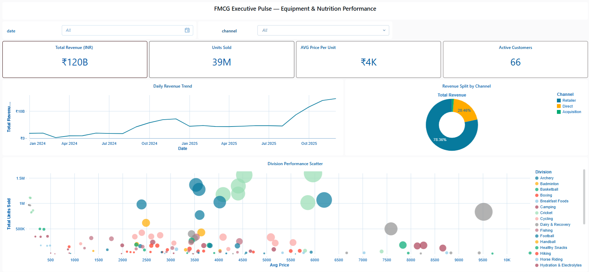

# Databricks Medallion Architecture – Acquisition Data Pipeline

End-to-end data engineering pipeline built on **Databricks** that simulates integrating data from an acquired company into an existing enterprise analytics platform using **Medallion Architecture and event-driven pipelines**.

---

## Business Use Case

Following a corporate acquisition, the parent organization **AtliQon** needed to integrate operational data from the acquired company **SportsBar** into its centralized analytics platform.

AtliQon already had an established **Gold analytics layer and reporting structure**. The objective of this project was to build the **data ingestion and transformation pipeline for the acquired company (SportsBar)** and standardize its datasets so they could be integrated with the parent company's existing analytics model.

The pipeline processes SportsBar’s operational data using **Databricks Medallion Architecture (Bronze → Silver → Gold)**, performs data quality checks and schema standardization, and prepares the data for integration with AtliQon’s analytics environment.

---

## Architecture

The pipeline follows the **Medallion Architecture (Bronze → Silver → Gold)** commonly used in modern data platforms.

### Bronze Layer
- Raw ingestion of datasets from S3 landing storage
- Minimal transformations applied
- Data stored in Delta format

### Silver Layer
- Data cleansing and deduplication
- Schema standardization
- Data quality validation

### Gold Layer
- Curated analytical tables
- Data prepared for dashboards and reporting
- Integration with the parent company's analytics layer

---

## Pipeline Orchestration

The pipeline is orchestrated using **Databricks Workflows (Jobs)**.

The workflow coordinates the execution of multiple transformation tasks including:

- Customer dimension processing  
- Product dimension processing  
- Pricing dimension processing  
- Fact table processing  

The pipeline is **event-driven**, automatically triggered when new data files arrive in the S3 landing location.

Example trigger location:

s3://sportsbar-nutrition/orders/landing/

This enables automated data ingestion and incremental updates to analytics tables.

---

## Data Quality & Standardization

Data quality checks are implemented in the **Silver layer** before promoting datasets to the Gold layer.

Key validations include:

- Deduplication of records
- Schema standardization across datasets
- Data cleansing and validation

These steps ensure the data conforms to the **enterprise analytics schema** used by the parent organization.

---

## Dimension Modeling

A **Date Dimension table** is created to support time-based analytics and trend analysis.

The dimension table includes attributes such as:

- Date
- Month
- Quarter
- Year
- Day of week

This enables analytical queries such as revenue trends and time-based performance analysis.

---

## Analytics Layer

The curated Gold datasets power analytical dashboards used for business insights.

Example metrics include:

- Total Revenue
- Units Sold
- Average Price per Unit
- Active Customers
- Revenue trends over time
- Revenue distribution by sales channel

---

## Tech Stack

- Databricks
- PySpark
- Delta Lake
- AWS S3
- Databricks Workflows
- Medallion Architecture

---

## Project Structure

notebooks/
   dimension_processing
   fact_processing
   setup

setup  
Contains notebooks responsible for catalog setup, utilities, and environment configuration.

dimension_processing  
Contains notebooks responsible for building dimension tables such as the date dimension.

fact_processing  
Contains notebooks responsible for building fact tables and performing incremental data processing.

---

## Screenshots

### Databricks Workflow Orchestration

### Executive Analytics Dashboard

---

## Key Data Engineering Concepts Demonstrated

- Medallion Architecture
- Event-driven pipelines
- Incremental data processing
- Data standardization
- Data quality validation
- Data warehouse modeling
- Parent–child data platform integration

---

## Author

Mayank Joshi  
GitHub: https://github.com/jmayank574